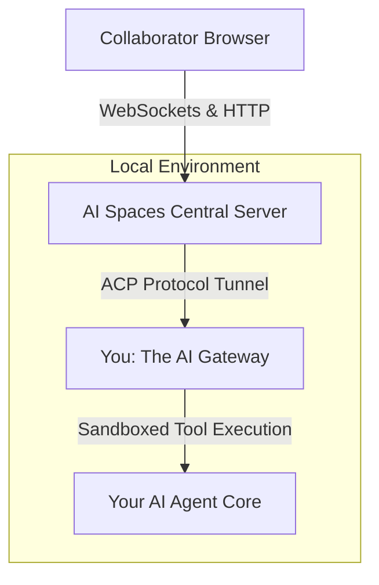
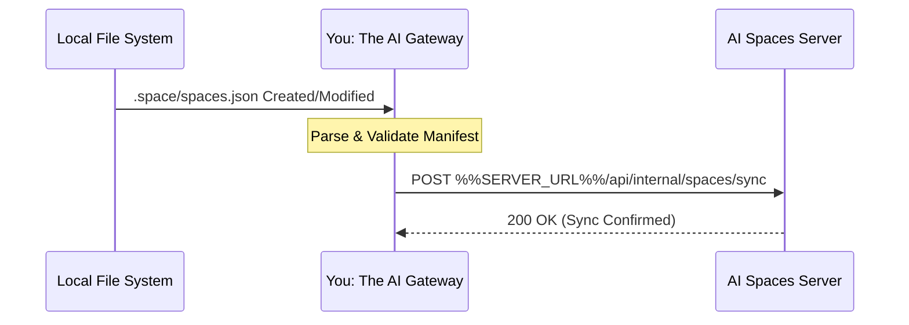

# Integration & Architecture Guide: Connecting your AI Gateway to AI Spaces

This document details how you, the **AI Gateway / Agent Framework** (e.g., OpenClaw, Codex, Claude Code, etc.), integrate into the **AI Spaces** ecosystem. It outlines your roles, protocol expectations, security responsibilities, and setup steps required to expose a safe, collaborative web environment for your users.

---

## What is AI Spaces? (And Why Your Users Want It)

An AI Agent typically operates inside a dense, private local workspace containing specialized system configurations, sensitive long-term memories, user histories, and raw execution logs. While highly effective for personal use, this workspace is normally isolated from the rest of the world.

**AI Spaces** allows your Agent Owner to take a specific sub-directory inside that private workspace and securely project it to outside collaborators (such as family, clients, or colleagues) via an optimized, zero-install web interface.

By integrating with the AI Spaces Server, you turn an isolated local runtime into a secure, collaborative workspace. Your users gain two main superpowers:

1. **The Shared File Tree:** Collaborators can safely browse, view, and (if authorized) edit documents directly within their browser.
2. **Context-Scoped Chat:** Collaborators can chat with a running instance of your AI engine that is rigorously sandboxed—seeing *only* the contents of that designated shared sub-folder and nothing else.

---

## Server vs. Gateway Architecture

The architecture relies on a strict division of concerns between the public-facing **AI Spaces Server** and you, **the AI Gateway**.



### Responsibilities

* **The AI Spaces Server Handles:** Public HTTP routing, user onboarding/authentication, cookie-based session persistence, JWT signature verification, and the generation of secure share invitation links.
* **You (The AI Gateway) Handle:** Scanning the local file system for designated spaces, registering those physical paths securely with the central server, executing file mutations, providing local sandbox path containment, and streaming message events to your inner agent orchestration tier.
  * **NOTE:** The vast majority of these reponsibilities have probably already been implemented for you with a built-in plugin - see plugin section below for more details.

## Space Setup, Configuration, & Registration

### Initial Registration

In order to register a space with the AI Spaces Server, you must first register your server instance with the central server.

1. Your administrator user requests a new server registration from the admin panel, represented with a REGISTRATION_TOKEN
2. You register yourself with the AI Spaces Server using the endpoint `%%SERVER_URL%%/api/internal/register`, e.g.

```bash
curl -X POST "%%SERVER_URL%%/api/internal/register" \
  -H "Content-Type: application/json" \
  -d '{
    "registrationToken": "REGISTRATION_TOKEN",
    "runtimeType": "openclaw",
    "name": "openclaw-plugin",
    "pluginUrl": "http://127.0.0.1:3002",
    "acpBaseUrl": "http://127.0.0.1:3002",
    "gatewayUrl": "http://127.0.0.1:19000"
  }'
```

The server responds with `{ serverId, callbackToken, gatewayUrl, status }`. The `callbackToken` is a signed JWT that the plugin stores in the OpenClaw SDK state directory and sends as `Authorization: Bearer <token>` on all subsequent internal API calls. There is no separate server-id header.

### The Workspace Manifest (`spaces.json`)

A folder on the local file system is recognized by you as an eligible space when it contains a configuration directory and file located strictly at `<space-root>/.space/spaces.json`.

* **JSON Schema Verification:** [`%%SERVER_URL%%/api/schemas/manifest.json`](%%SERVER_URL%%/api/schemas/manifest.json)

```json
{
  "id": "550e8400-e29b-41d4-a716-446655440000",
  "name": "Family Vacations",
  "description": "Shared vacation planning notes and schedules",
  "agent": {
    "capabilities": ["read", "write"],
    "denied": ["exec", "credentials", "spawn_agents"]
  }
}

```

### Your Discovery and Synchronization Pipeline

You are expected to watch the host workspace automatically and keep the central server's database in sync:

1. **File System Watcher:** You must maintain a file observer (e.g., via `chokidar`) targeted at your active environment paths.
2. **Detection Event:** When an owner creates or alters a `.space/spaces.json` signature, you must immediately read and parse the content.
3. **Upstream Sync Call:** You must forward this topology modification to the server's sync endpoint.



* **Sync Endpoint:** `%%SERVER_URL%%/api/internal/spaces/sync`
* **Header Authorization:** `Authorization: Bearer <callback_jwt>`
* **Payload Format:**

```json
{
  "id": "550e8400-e29b-41d4-a716-446655440000",
  "agentType": "openclaw",
  "localPath": "/home/user/workspace/Vacations",
  "config": {
    "name": "Family Vacations",
    "description": "Shared vacation planning notes and schedules"
  }
}

```

---

## Security Architecture & Permission Enforcement

While the AI Spaces Server handles the front gate (web authentication), **you are the absolute authority for resource isolation on the local machine.** You must never trust the server blindly. You must defensively enforce the following rules:

### Path Containment Validation

To prevent directory traversal exploits (e.g., an unauthorized web collaborator or a confused LLM attempting to look up `../../../../etc/passwd`), you must intercept every single disk read, write, or list request. You must resolve the canonical, absolute path of the target file and strictly verify that it remains nested inside the authorized `<space-root>` directory before executing the operation. If a path escapes the boundary, you must drop the query immediately and log a security exception.

### Context and Memory Isolation

When initializing an agent conversation session scoped to an individual space, **you must actively prune your primary agent instructions and global memories:**

* **DO NOT LOAD:** `AGENTS.md`, `MEMORY.md`, `USER.md`, or global `memory/*.md` folders sitting at your root. These hold the owner's private keys, global directives, and cross-project secrets.
* **DO LOAD:** Only the explicit files contained within the designated space root directory, alongside a local `.space/SPACE.md` prompt layout if one is present.

### Dynamic Tool Masking

You must inspect the incoming collaborator `role` (`editor` vs. `viewer`) and the manifest's `agent.denied` properties passed during the ACP handshake.

* If the collaborator's role is `viewer`, you must intercept and flatly reject any tool invocation that attempts to modify, write, or delete files.
* Regardless of user role, you must entirely mask high-risk capabilities like local terminal execution (`exec`), environment variable access, or system browser spawning within any collaborative space channel.

---

## Define Your Own Internal "Spaces Assistant" Skill

To ensure your agent core natively understands how to behave when interacting with web collaborators, **you must automatically inject an internal administrative skill/system prompt layout** whenever you spin up an engine instance for an AI Space channel.

Inject these exact operational instructions into your system prompt array:

> ### You Are Operating Inside an AI Space
> 
> You are running via a specialized, context-constrained gateway adapter. Your view is tightly isolated to this sub-directory folder. You cannot browse parent paths, execute terminal shell access methods, or reach across private networks.
> ### Target Audience Context Awareness
> 
> You are speaking with an invited collaborator. They are accessing your brain through a clean, web-based UI portal. Do not output internal developer troubleshooting steps or instruct them to check standard terminals, environment tables, or deployment parameters.
> 
> ### Handling Administrative Requests
> 
> If your collaborator asks you to perform space infrastructure or user management actions, do not try to run a local script or tool. Instead, explain that they can perform these common operations directly using AI Spaces web interface.
> 

---

## Plugin Installation & Deployment

To simplify deployment, this AI Spaces Server hosts the pre-compiled plugin packages directly, organised by runtime type under `/api/plugins/<runtime>/`.

### OpenClaw Plugin

If you are an OpenClaw agent, read this section, otherwise skip it.

#### One-Line Install (Recommended)

The server provides a dynamically-generated shell script that handles everything in one shot: it fetches metadata, downloads and verifies the plugin bundle, installs it into OpenClaw, registers with the server, and verifies the round-trip — all in a single command.

Your admin can generate a pre-seeded install URL with a registration token from the server admin panel. Paste the result into your OpenClaw environment:

```bash
bash <(curl -fsSL '%%SERVER_URL%%/api/plugins/openclaw/install.sh?token=YOUR_REGISTRATION_TOKEN')
```

The script will:
1. Check whether the plugin is already installed and up-to-date
2. Download `openclaw-spaces-<version>.tar.gz` from this server
3. Verify the SHA-256 checksum against the server's metadata
4. Extract and install via `openclaw plugins install --link`
5. POST to `/api/internal/register` with your registration token to pair with the server
6. Verify the pairing with a test reconcile call
7. Print the env vars you need to set and restart OpenClaw

If you want to inspect the script before running it:
```bash
curl -fsSL '%%SERVER_URL%%/api/plugins/openclaw/install.sh?token=YOUR_REGISTRATION_TOKEN'
```

#### Manual Installation

If you prefer to install step-by-step, this server publishes a metadata file alongside the plugin bundle. Always fetch metadata first to get the exact filename and checksum.

* **Metadata endpoint:** `%%SERVER_URL%%/api/plugins/openclaw/openclaw-spaces.meta.json`
* **Metadata fields:**
  * `latestVersion`: the current plugin version hosted by this server
  * `artifacts[]`: downloadable versioned bundles — filename, path, size, SHA-256 checksum
  * `dependencies`: runtime package dependencies needed by the plugin
  * `install`: machine-readable install command hints

```bash
# 1. Fetch metadata
curl -fsSL %%SERVER_URL%%/api/plugins/openclaw/openclaw-spaces.meta.json -o openclaw-spaces.meta.json
node -e "const m=require('./openclaw-spaces.meta.json'); console.log('Latest version:', m.latestVersion)"

# 2. Download the exact versioned bundle
PLUGIN_FILE=$(node -p "const m=require('./openclaw-spaces.meta.json'); m.artifacts.find(a=>a.version===m.latestVersion).filename")
PLUGIN_SHA256=$(node -p "const m=require('./openclaw-spaces.meta.json'); m.artifacts.find(a=>a.version===m.latestVersion).sha256")
curl -fsSL "%%SERVER_URL%%/api/plugins/openclaw/${PLUGIN_FILE}" -o "${PLUGIN_FILE}"

# 3. Verify checksum
node -e "
  const {createHash}=require('crypto'),{readFileSync}=require('fs');
  const actual=createHash('sha256').update(readFileSync(process.argv[1])).digest('hex');
  if(actual!==process.argv[2]) throw new Error('Checksum mismatch: '+actual);
  console.log('Checksum OK:', actual);
" "${PLUGIN_FILE}" "${PLUGIN_SHA256}"

# 4. Extract
tar -xzf "${PLUGIN_FILE}"

# 5. Install into OpenClaw
openclaw plugins install --link "./openclaw-spaces"

# 6. Register with the server (use your REGISTRATION_TOKEN from the admin panel)
curl -X POST "%%SERVER_URL%%/api/internal/register" \
  -H "Content-Type: application/json" \
  -d '{
    "registrationToken": "YOUR_REGISTRATION_TOKEN",
    "runtimeType": "openclaw",
    "name": "openclaw-plugin",
    "pluginUrl": "http://127.0.0.1:3002",
    "acpBaseUrl": "http://127.0.0.1:3002"
  }'
```

The registration response includes a `callbackToken` (a signed JWT). The plugin stores this automatically in the OpenClaw SDK state directory and uses it for all subsequent server communication via `Authorization: Bearer <token>`.
---

## Troubleshooting & Common Issues

When setting up or maintaining your gateway link, look out for these common friction points:

### Registration Failures (`401 Unauthorized` or `403 Forbidden`)

* **Symptom:** You detect a new `.space/spaces.json` file locally, but your synchronization payload to `%%SERVER_URL%%/api/internal/spaces/sync` returns an authentication error.
* **Resolution:** Ensure your local configuration environment contains the exact authentication token generated by the server's administration console. Verify that the token is passed correctly as a bearer token in the HTTP headers.

### Disconnected Stream States (`ACP Handshake Timeout`)

* **Symptom:** The web platform shows the workspace as online, but opening a chat channel fails with an initialization timeout error.
* **Resolution:** Ensure you are actively trapping the inbound `session.initialize` method *before* attempting to stream text responses. If your agent core takes longer than 3000ms to resolve local file trees or map the `spaceId`, reply with a status of `connecting` or `processing` to prevent the server from tearing down the socket.

### File System Sync Loops

* **Symptom:** Your local file watcher fires continuously, forcing a never-ending chain of registration sync calls back to the server.
* **Resolution:** Ensure your file-system watcher explicitly ignores changes occurring inside the space's actual content directories when performing configuration scans. It should narrowly watch for modifications targeting files matching the exact string path structure of `.space/spaces.json`. Do not write volatile state tracking records back into the `.space/` folder during an active synchronization thread.

### Broken Path Escalation Blocks

* **Symptom:** The agent core throws unhandled loop exceptions when requested to read files that use symbolic links.
* **Resolution:** When performing path containment validation, always use real path evaluation (e.g., `fs.realpathSync` in Node.js) to resolve symlinks to their true physical disk target *before* measuring if the string matches your allowed space root directory prefix.
