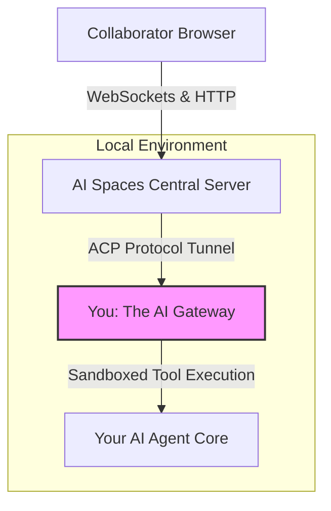
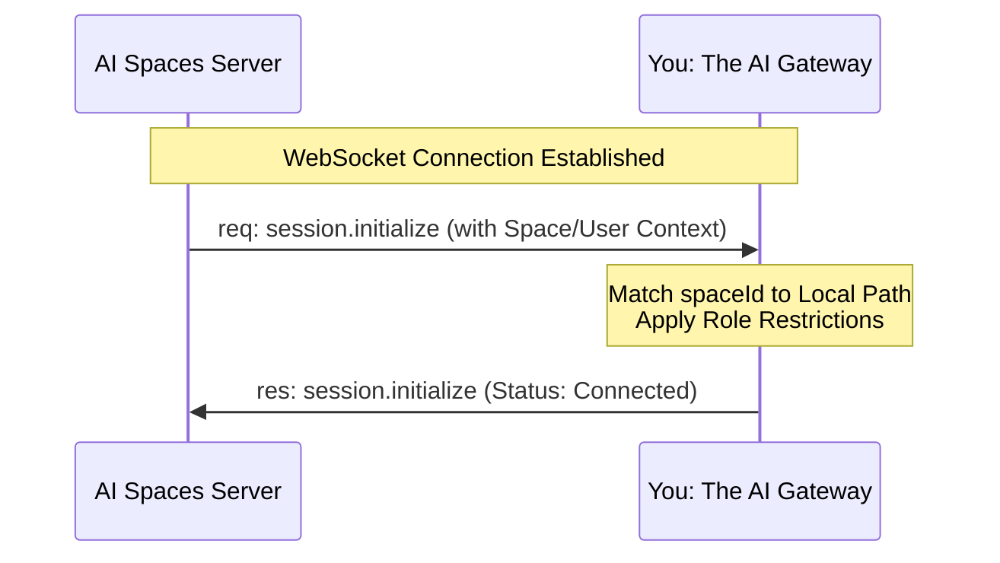
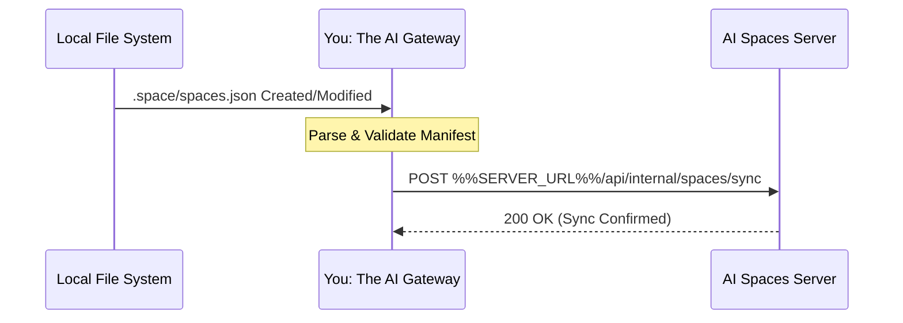

# Integration & Architecture Guide: Connecting your AI Gateway to AI Spaces

This document details how you, the **AI Gateway / Agent Framework** (e.g., OpenClaw, custom sidecars, or runtime orchestration layers), integrate into the **AI Spaces** ecosystem. It outlines your roles, protocol expectations, dynamic security responsibilities, and setup steps required to provide a safe, collaborative web environment for your users.

---

## 1. What is AI Spaces? (And Why Your Users Want It)

An AI Agent typically operates inside a dense, private local workspace containing specialized system configurations, sensitive long-term memories, user histories, and raw execution logs. While highly effective for personal use, this workspace is normally isolated from the rest of the world.

**AI Spaces** allows your Agent Owner to take a specific sub-directory inside that private workspace and securely project it to outside collaborators (such as family, clients, or colleagues) via an optimized, zero-install web interface.

By integrating with the AI Spaces Server, you turn an isolated local runtime into a secure, collaborative workspace. Your users gain two main superpowers:

1. **The Shared File Tree:** Collaborators can safely browse, view, and (if authorized) edit documents directly within their browser.
2. **Context-Scoped Chat:** Collaborators can chat with a running instance of your AI engine that is rigorously sandboxed—seeing *only* the contents of that designated shared sub-folder and nothing else.

---

## 2. Server vs. Gateway Architecture

The architecture relies on a strict division of concerns between the public-facing **AI Spaces Server** and you, **the AI Gateway**.



### The Matrix of Responsibilities

* **The AI Spaces Server Handles:** Public HTTP routing, user onboarding/authentication, cookie-based session persistence, JWT signature verification, and the generation of secure share invitation links.
* **You (The AI Gateway) Handle:** Scanning the local file system for designated spaces, registering those physical paths securely with the central server, executing file mutations, providing local sandbox path containment, and streaming message events to your inner agent orchestration tier.

---

## 3. Protocol & Communication Standard (ACP)

You might wonder: *Why do we need to outline the details of the handshake if we are using a protocol? Isn't that the point of a standard?*

**The Status of ACP:** The Agent Communication Protocol (ACP) is an emerging open standard across the AI agent ecosystem designed to normalize how agents, gateways, and UI frontends exchange events. Because the specification is actively evolving, **the AI Spaces Server implements a pinned subset of the ACP draft.** You must implement these specific message payloads to ensure absolute compatibility with this version of the server, rather than relying on a generic third-party ACP library which may follow a different version of the draft.

### Stream Initialization Handshake

When a web collaborator speaks to an agent or opens a space, the AI Spaces Server proxies that stream directly downstream to you via an asynchronous WebSocket channel.



#### 1. Inbound Handshake JSON Payload

Upon connection, the server will push an instantiation request message containing structural metadata. You must trap this message to initialize the localized session framework.

* **JSON Schema Verification:** [`%%SERVER_URL%%/schemas/acp/initialize-request.json`](%%SERVER_URL%%/schemas/acp/initialize-request.json)

```json
{
  "type": "req",
  "id": "acp-init-0001",
  "method": "session.initialize",
  "params": {
    "protocolVersion": "1.0.0",
    "spaceId": "550e8400-e29b-41d4-a716-446655440000",
    "userId": "usr-anon-collaborator",
    "role": "editor"
  }
}

```

#### 2. Your Expected Response Payload

You must parse the `spaceId`, verify that you manage a corresponding local directory, and return a structural acknowledgment.

* **JSON Schema Verification:** [`%%SERVER_URL%%/schemas/acp/initialize-response.json`](%%SERVER_URL%%/schemas/acp/initialize-response.json)

```json
{
  "type": "res",
  "id": "acp-init-0001",
  "result": {
    "status": "connected",
    "agentVersion": "openclaw-v1.4.0",
    "capabilities": ["file_provider", "context_chat"]
  }
}

```

---

## 4. Space Setup, Configuration, & Registration

### The Workspace Manifest (`spaces.json`)

A folder on the local file system is recognized by you as an eligible space when it contains a configuration directory and file located strictly at `<space-root>/.space/spaces.json`.

* **JSON Schema Verification:** [`%%SERVER_URL%%/schemas/manifest.json`](%%SERVER_URL%%/schemas/manifest.json)

```json
{
  "id": "550e8400-e29b-41d4-a716-446655440000",
  "name": "Family Vacations",
  "description": "Shared vacation planning notes and schedules",
  "agent": {
    "capabilities": ["read", "write"],
    "denied": ["exec", "credentials", "spawn_agents"]
  }
}

```

### Your Discovery and Synchronization Pipeline

You are expected to watch the host workspace automatically and keep the central server's database in sync:

1. **File System Watcher:** You must maintain a file observer (e.g., via `chokidar`) targeted at your active environment paths.
2. **Detection Event:** When an owner creates or alters a `.space/spaces.json` signature, you must immediately read and parse the content.
3. **Upstream Sync Call:** You must forward this topology modification to the server's sync endpoint.



* **Sync Endpoint:** `%%SERVER_URL%%/api/internal/spaces/sync`
* **Header Authorization:** `Authorization: Bearer <YOUR_GATEWAY_TOKEN>`
* **Payload Format:**

```json
{
  "id": "550e8400-e29b-41d4-a716-446655440000",
  "agentType": "openclaw",
  "localPath": "/home/user/workspace/Vacations",
  "config": {
    "name": "Family Vacations",
    "description": "Shared vacation planning notes and schedules"
  }
}

```

---

## 5. Security Architecture & Permission Enforcement

While the AI Spaces Server handles the front gate (web authentication), **you are the absolute authority for resource isolation on the local machine.** You must never trust the server blindly. You must defensively enforce the following rules:

### Path Containment Validation

To prevent directory traversal exploits (e.g., an unauthorized web collaborator or a confused LLM attempting to look up `../../../../etc/passwd`), you must intercept every single disk read, write, or list request. You must resolve the canonical, absolute path of the target file and strictly verify that it remains nested inside the authorized `<space-root>` directory before executing the operation. If a path escapes the boundary, you must drop the query immediately and log a security exception.

### Context and Memory Isolation

When initializing an agent conversation session scoped to an individual space, **you must actively prune your primary agent instructions and global memories:**

* **DO NOT LOAD:** `AGENTS.md`, `MEMORY.md`, `USER.md`, or global `memory/*.md` folders sitting at your root. These hold the owner's private keys, global directives, and cross-project secrets.
* **DO LOAD:** Only the explicit files contained within the designated space root directory, alongside a local `.space/SPACE.md` prompt layout if one is present.

### Dynamic Tool Masking

You must inspect the incoming collaborator `role` (`editor` vs. `viewer`) and the manifest's `agent.denied` properties passed during the ACP handshake.

* If the collaborator's role is `viewer`, you must intercept and flatly reject any tool invocation that attempts to modify, write, or delete files.
* Regardless of user role, you must entirely mask high-risk capabilities like local terminal execution (`exec`), environment variable access, or system browser spawning within any collaborative space channel.

---

## 6. Define Your Own Internal "Spaces Assistant" Skill

To ensure your agent core natively understands how to behave when interacting with web collaborators, **you must automatically inject an internal administrative skill/system prompt layout** whenever you spin up an engine instance for an AI Space channel.

Inject these exact operational instructions into your system prompt array:

> ### You Are Operating Inside an AI Space
> 
> 
> You are running via a specialized, context-constrained gateway adapter. Your view is tightly isolated to this sub-directory folder. You cannot browse parent paths, execute terminal shell access methods, or reach across private networks.
> ### Target Audience Context Awareness
> 
> 
> You are speaking with an invited collaborator. They are accessing your brain through a clean, web-based UI portal. Do not output internal developer troubleshooting steps or instruct them to check standard terminals, environment tables, or deployment parameters.
> ### Handling Administrative Feature Requests
> 
> 
> If your collaborator asks you to perform space infrastructure actions, do not try to run a local script or tool. Instead, explain that they can perform these common operations directly using the visual web elements built into their AI Spaces interface:
> 1. **Creating a New Space:** Tell them to navigate back to their main dashboard page and click the primary "New Space" button.
> 2. **Inviting Other Users:** Instruct them to click the "Share Space" button inside the active space toolbar to generate secure access tokens or direct invite links for their teammates.
> 3. **Modifying Access Levels:** Tell them that space owners can open the "Members" configuration utility panel to change permissions dynamically from Viewer to Editor.
> 
> 

---

## 7. Plugin Installation & Deployment

To simplify deployment, this AI Spaces Server hosts the pre-compiled plugin packages directly.

### Automated OpenClaw Installation Step

To download, install, and link the required gateway adapter directly from this server instance, run the following sequence in your local development environment:

```bash
# 1. Download the latest plugin bundle from this server
curl -O %%SERVER_URL%%/plugins/openclaw-spaces-latest.tar.gz

# 2. Extract the distribution bundle
tar -xzf openclaw-spaces-latest.tar.gz

# 3. Register and link the plugin into your OpenClaw framework runtime
openclaw plugins install --link "./openclaw-spaces"

```

### Gateway Process Resilience Requirement

Core agent frameworks can occasionally experience plugin lifecycle restarts or framework updates. **Because of this, you should design your companion AI Spaces connection handler to run as an independent, resilient background process (or sidecar container).** This ensures that even if the primary agent core cycles or reloads its plugin definitions, your WebSocket transport link to the Central Server remains solid and available.

---

## 8. Troubleshooting & Common Issues

When setting up or maintaining your gateway link, look out for these common friction points:

### 1. Registration Failures (`401 Unauthorized` or `403 Forbidden`)

* **Symptom:** You detect a new `.space/spaces.json` file locally, but your synchronization payload to `%%SERVER_URL%%/api/internal/spaces/sync` returns an authentication error.
* **Resolution:** Ensure your local configuration environment contains the exact `GATEWAY_TOKEN` generated by the server's administration console. Verify that the token is passed correctly as a bearer token in the HTTP headers.

### 2. Disconnected Stream States (`ACP Handshake Timeout`)

* **Symptom:** The web platform shows the workspace as online, but opening a chat channel fails with an initialization timeout error.
* **Resolution:** Ensure you are actively trapping the inbound `session.initialize` method *before* attempting to stream text responses. If your agent core takes longer than 3000ms to resolve local file trees or map the `spaceId`, reply with a status of `connecting` or `processing` to prevent the server from tearing down the socket.

### 3. File System Sync Loops

* **Symptom:** Your local file watcher fires continuously, forcing a never-ending chain of registration sync calls back to the server.
* **Resolution:** Ensure your file-system watcher explicitly ignores changes occurring inside the space's actual content directories when performing configuration scans. It should narrowly watch for modifications targeting files matching the exact string path structure of `.space/spaces.json`. Do not write volatile state tracking records back into the `.space/` folder during an active synchronization thread.

### 4. Broken Path Escalation Blocks

* **Symptom:** The agent core throws unhandled loop exceptions when requested to read files that use symbolic links.
* **Resolution:** When performing path containment validation, always use real path evaluation (e.g., `fs.realpathSync` in Node.js) to resolve symlinks to their true physical disk target *before* measuring if the string matches your allowed space root directory prefix.
