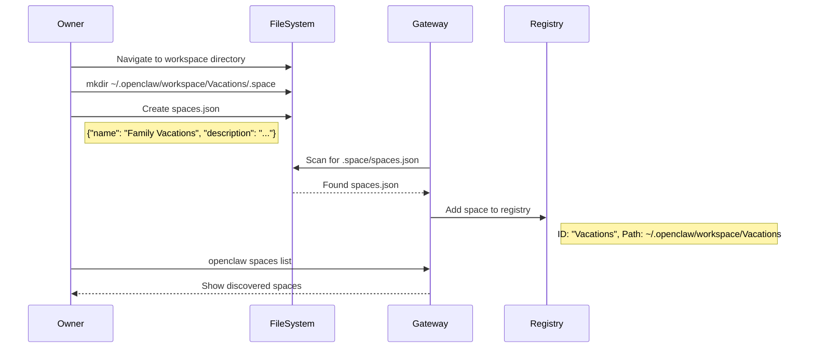
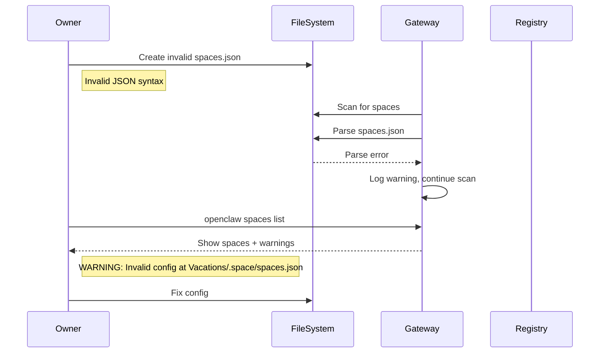
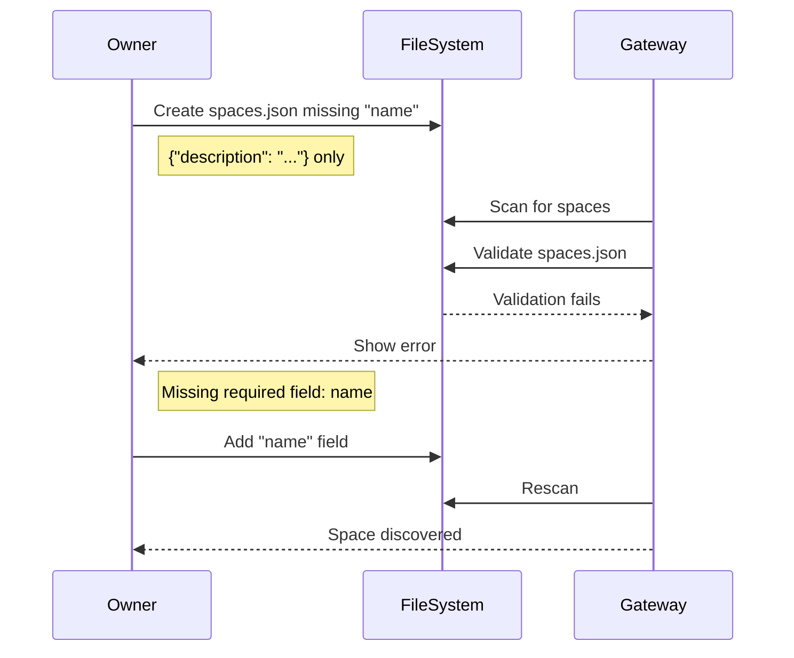
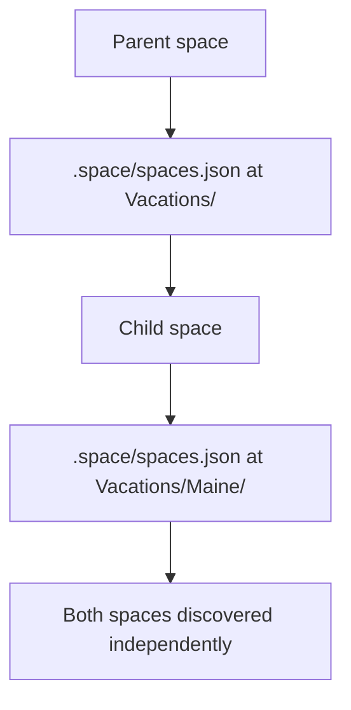
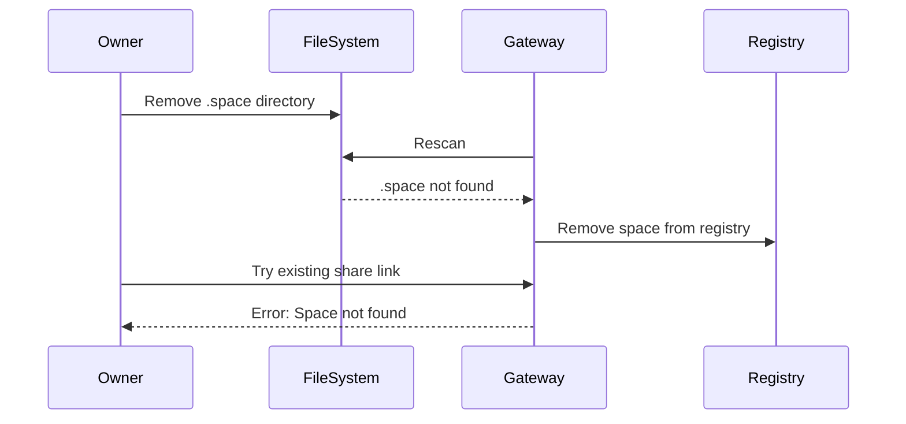
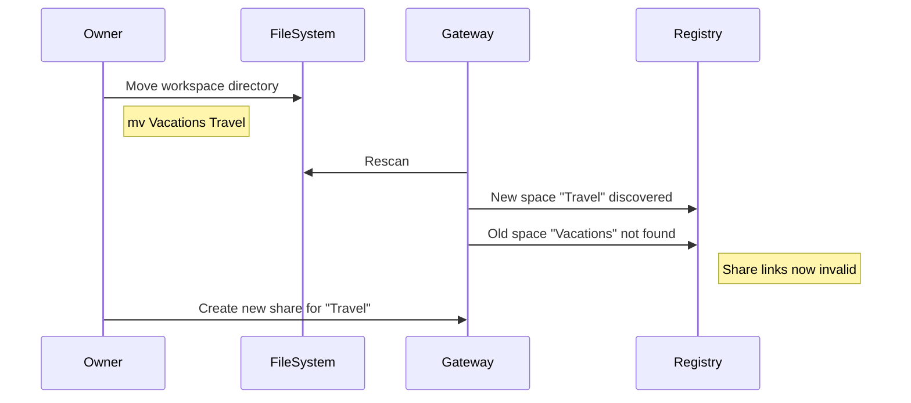

# Flow: Create Space

**Actors:** Owner  
**Trigger:** Owner wants to share a portion of their workspace

---

## Happy Path

---

## Error Paths

### E1: Invalid Config File

### E2: Missing Required Fields

---

## Edge Cases

### EC1: Nested Spaces

**Behavior:** Parent and child are independent spaces with separate configurations and share links.

### EC2: Deleted Space

### EC3: Moved Space

---

## Acceptance Tests

### Test 1: Basic Creation

**Given** workspace exists  
**When** owner creates `.space/spaces.json` with valid config  
**Then** `openclaw spaces list` shows the new space

### Test 2: Invalid Config

**Given** workspace exists  
**When** owner creates `.space/spaces.json` with invalid JSON  
**Then** `openclaw spaces list` shows warning  
**And** space is not added to registry

### Test 3: Nested Spaces

**Given** parent space exists  
**When** owner creates `.space/spaces.json` in child directory  
**Then** both spaces appear in `openclaw spaces list`  
**And** each has independent configuration

---

## Timing

| Step | Duration |
|------|----------|
| Create config file | Manual (seconds) |
| Discovery scan | < 10s (for workspace <10k dirs) |
| Total | < 20s |

---

## Post-Conditions

- Space appears in `openclaw spaces list`
- Space ready for share link creation
- `.space/` directory exists in workspace
- `spaces.json` valid and parseable