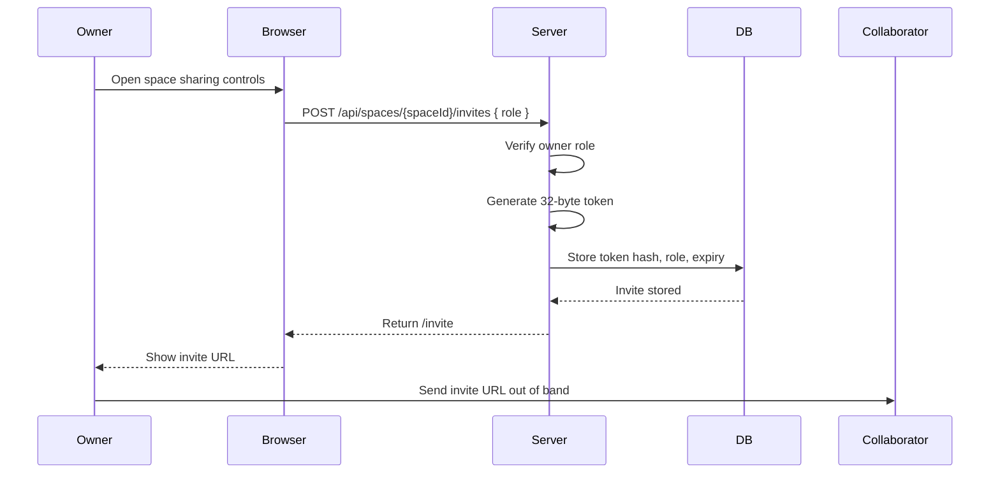
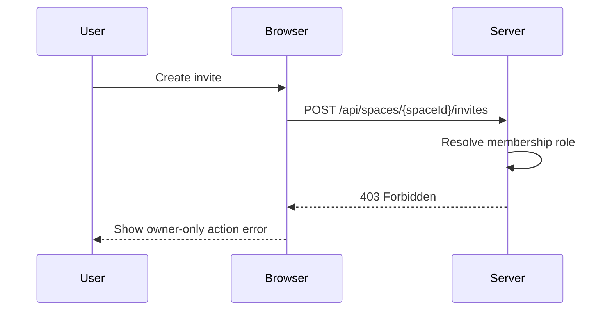
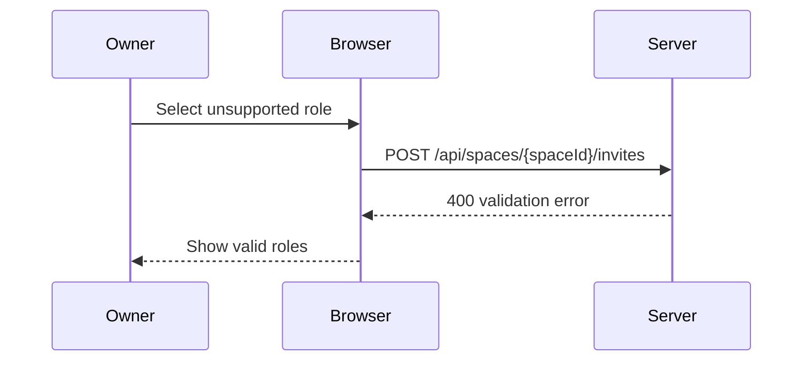
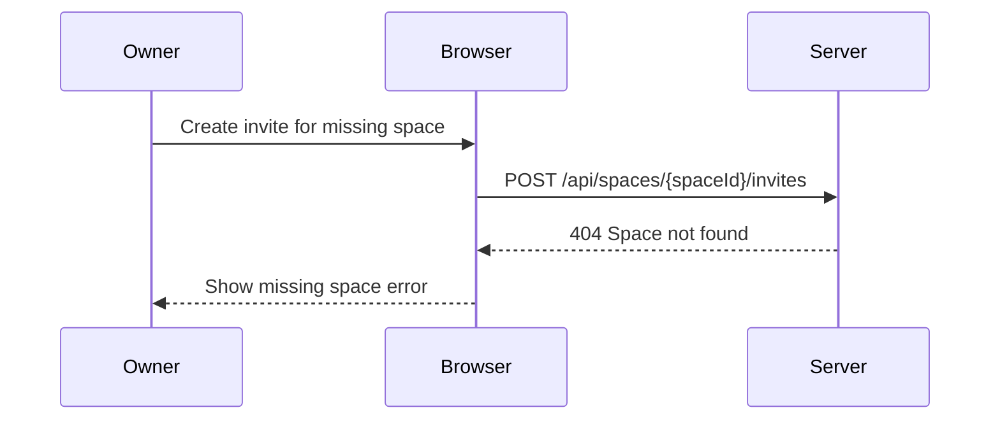

# Flow: Invite Registered Collaborator

**Actors:** Owner, registered collaborator
**Trigger:** Owner wants to give another user access to a space

Anonymous/public share links are parked. The current flow creates an invite token that must be redeemed by an authenticated user, producing a `space_members` record.

---

## Happy Path

---

## Error Paths

### E1: Caller Is Not Owner

### E2: Invalid Role

### E3: Space Not Found

---

## Acceptance Tests

### Test 1: Owner Creates Invite

**Given** an authenticated owner belongs to a space
**When** they create an editor invite
**Then** the server stores only a token hash
**And** the response includes an `/invite#token=...` URL
**And** the raw token is not persisted

### Test 2: Non-Owner Cannot Invite

**Given** an authenticated viewer or editor belongs to a space
**When** they create an invite
**Then** the server returns `403 Forbidden`

### Test 3: Invite Role Is Preserved

**Given** an owner creates a viewer invite
**When** the collaborator redeems it after login
**Then** the collaborator is added as a viewer member

---

## Post-Conditions

- Invite token hash stored in database
- Invite has role and expiration
- Raw invite URL displayed once for owner delivery
- No anonymous access session is created
