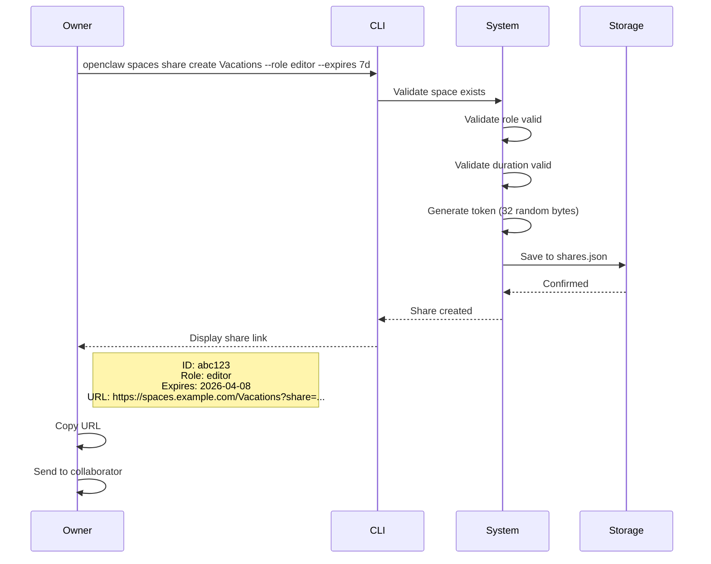
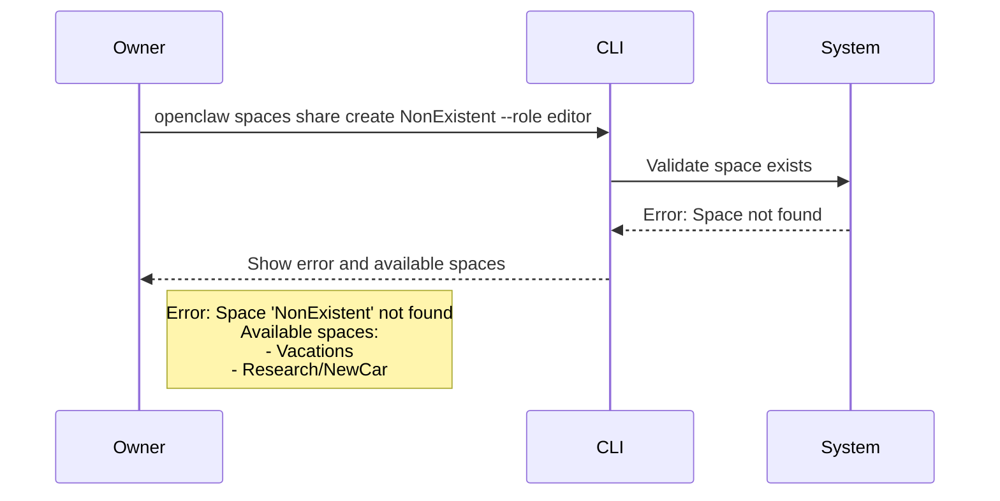
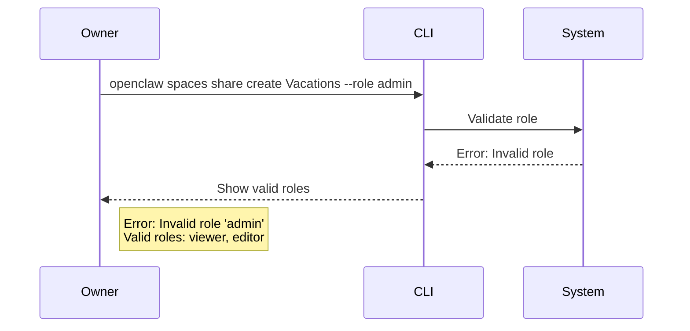
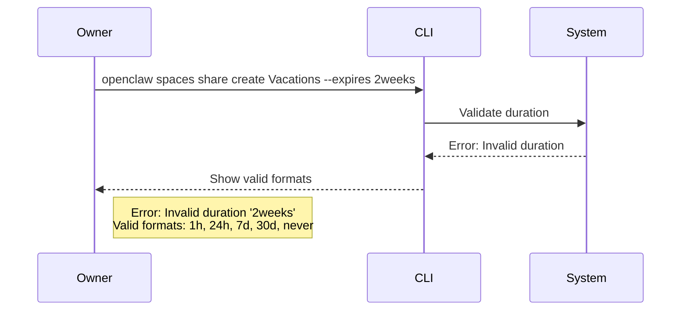
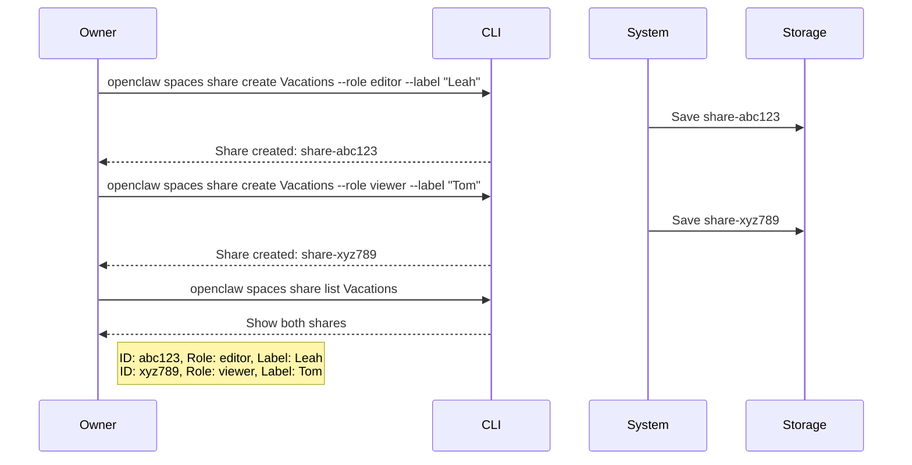
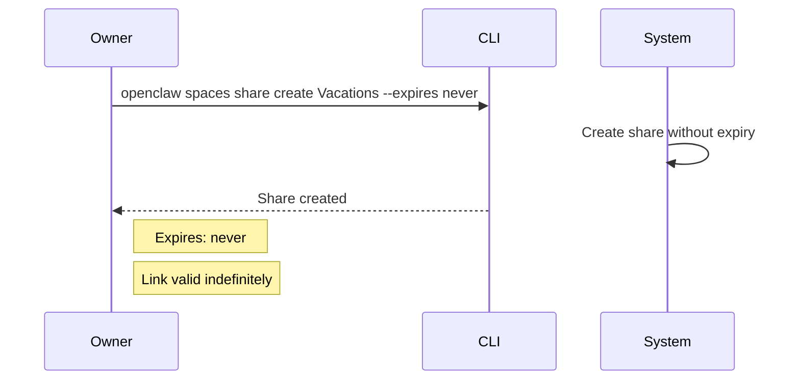

# Flow: Share Space

**Actors:** Owner  
**Trigger:** Owner wants to share space with collaborator

---

## Happy Path



---

## Error Paths

### E1: Space Not Found



### E2: Invalid Role



### E3: Invalid Duration



---

## Edge Cases

### EC1: Multiple Shares



### EC2: No Expiry



### EC3: Token Collision

```mermaid
flowchart LR
    A[Generate token] --> B{Collision check}
    B -->|Collision detected| C[Regenerate]
    C --> B
    B -->|Unique| D[Return token]
    
    Note right of B: Collision probability: ~0<br/>32 bytes = 2^256 possibilities
```

---

## Acceptance Tests

### Test 1: Basic Creation

**Given** space "Vacations" exists  
**When** owner runs `openclaw spaces share create Vacations --role editor`  
**Then** output contains valid share URL  
**And** URL matches format `https://spaces.example.com/Vacations?share=<token>`

### Test 2: Multiple Roles

**Given** space "Vacations" exists  
**When** owner creates viewer share  
**And** owner creates editor share  
**Then** `openclaw spaces share list Vacations` shows both  
**And** roles are correctly labeled

### Test 3: Expiry

**Given** space "Vacations" exists  
**When** owner creates share with `--expires 1h`  
**And** waits 61 minutes  
**Then** share link returns expired error

---

## Timing

| Step | Duration |
|------|----------|
| CLI command | < 1s |
| Token generation | < 100ms |
| Storage write | < 100ms |
| Total | < 2s |

---

## Post-Conditions

- Share link stored in `shares.json`
- Token cryptographically random
- Link ready to send to collaborator
- Expiry timer started (if set)