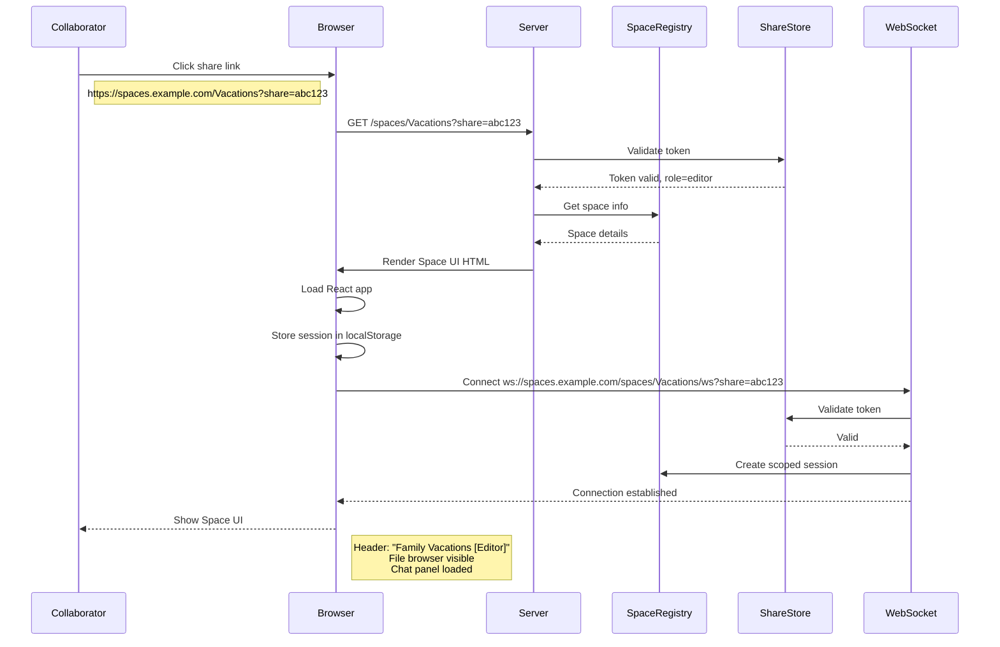
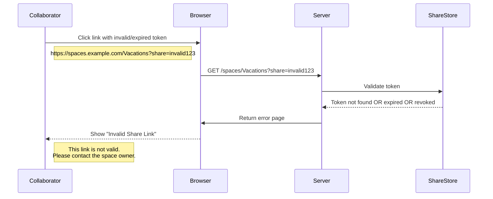
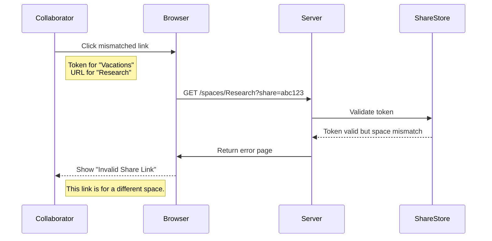
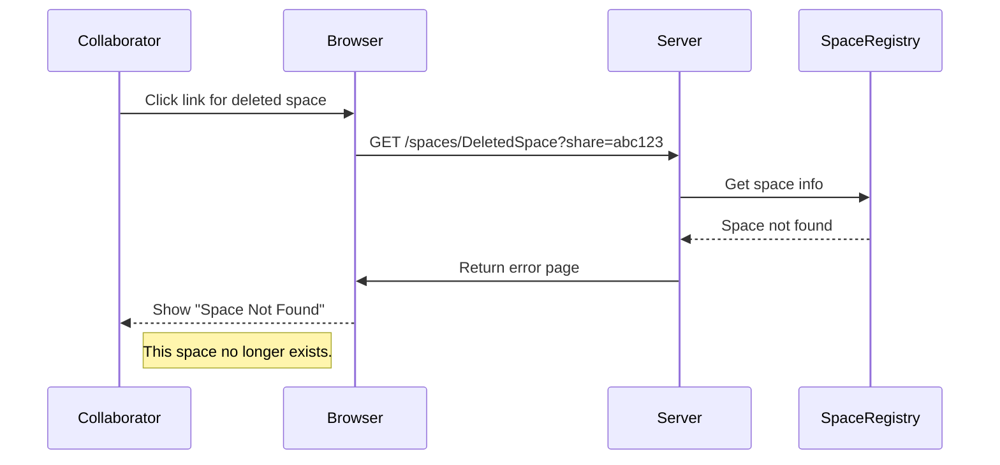
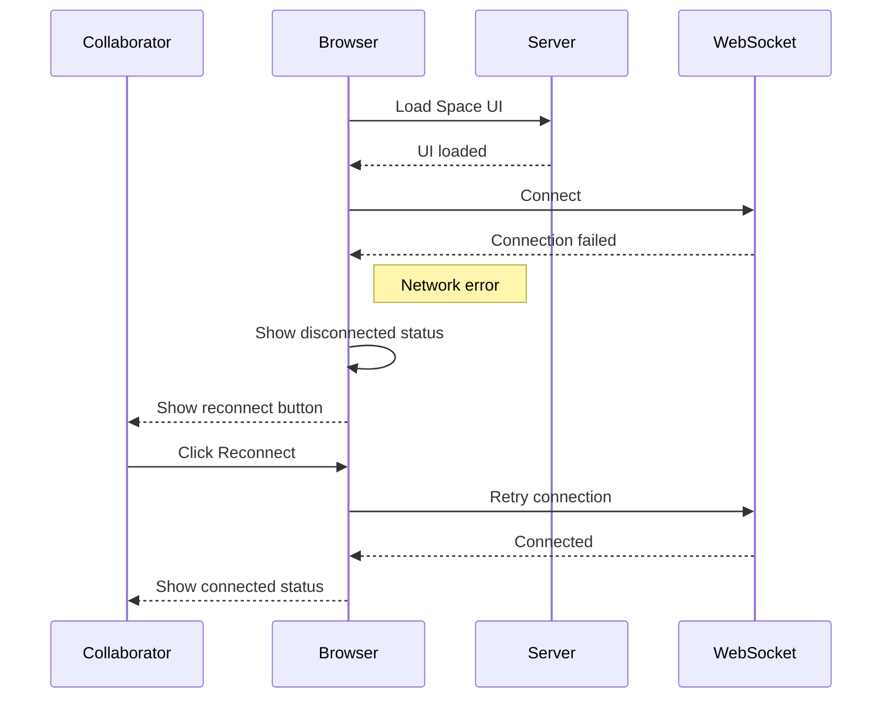
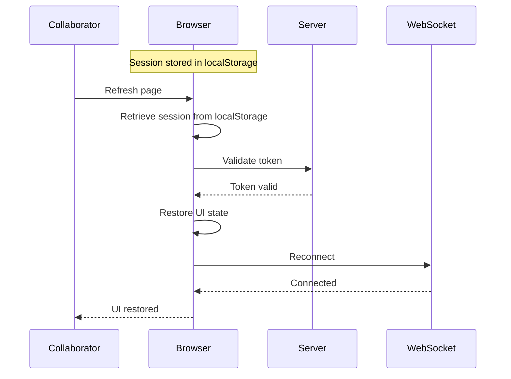
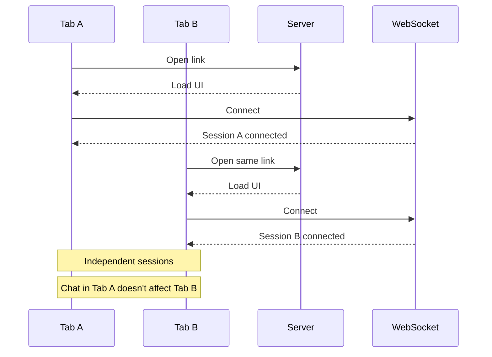

# Flow: Collaborator Access

**Actors:** Collaborator  
**Trigger:** Collaborator receives share link and clicks it

---

## Happy Path



---

## Error Paths

### E1: Invalid Token



### E2: Wrong Space



### E3: Space Not Found



### E4: WebSocket Fails



---

## Edge Cases

### EC1: Page Refresh



### EC2: Multiple Browser Tabs



### EC3: Mobile Browser

```mermaid
flowchart TD
    A[Mobile Browser] --> B[Load Space UI]
    B --> C{Responsive Layout}
    C --> D[File browser: hamburger menu]
    C --> E[Chat panel: slide from bottom]
    C --> F[Touch-friendly buttons]
    
    Note right of C: Same functionality<br/>Optimized layout
```

---

## Acceptance Tests

### Test 1: Valid Access

**Given** valid share token  
**When** collaborator opens link  
**Then** Space UI loads  
**And** role is displayed  
**And** file browser is visible  
**And** chat panel is loaded

### Test 2: Invalid Token

**Given** invalid or expired token  
**When** collaborator opens link  
**Then** error page shows "Invalid Share Link"  
**And** no session created

### Test 3: Expired Token

**Given** expired share token  
**When** collaborator tries to access  
**Then** error page shows "Share Link Expired"  
**And** expiration date displayed

---

## Timing

| Step | Duration |
|------|----------|
| Page load | < 1s |
| Token validation | < 100ms |
| Space info retrieval | < 100ms |
| WebSocket connection | < 500ms |
| File tree load | < 2s (lazy) |
| Total to interactive | < 3s |

---

## Post-Conditions

- Session stored in localStorage
- WebSocket established
- File tree visible
- Chat panel loaded
- Role displayed (Editor/Viewer)
- Expiry displayed (if applicable)