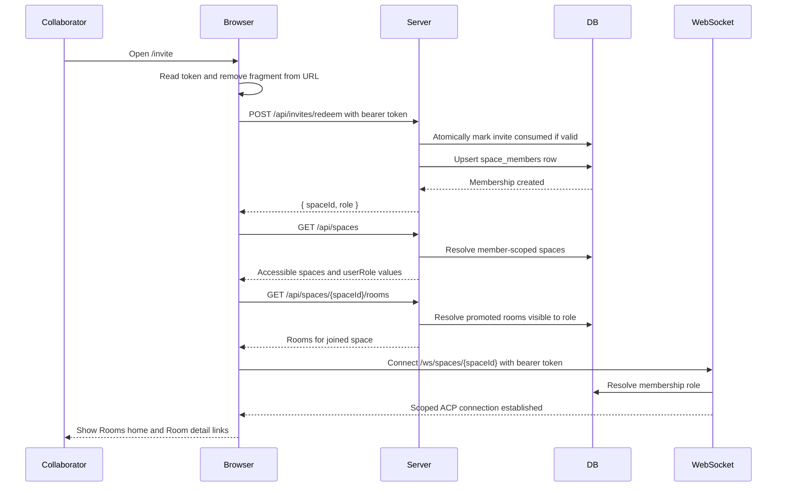
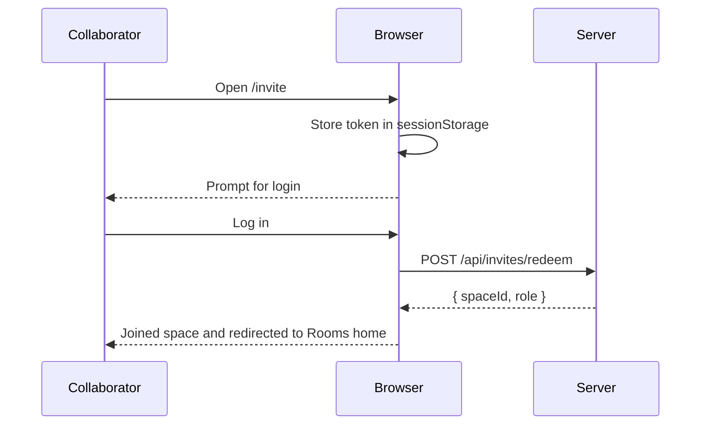
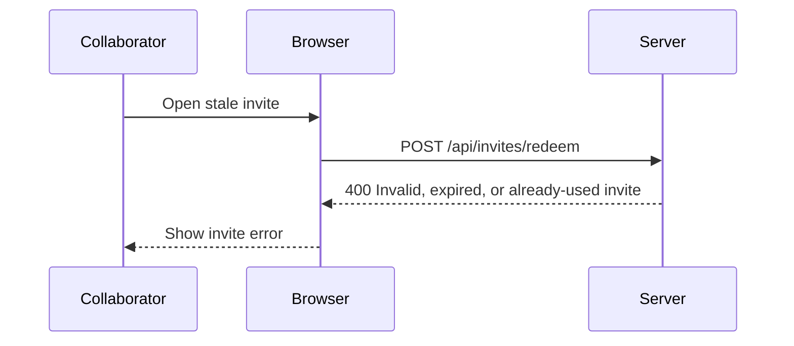
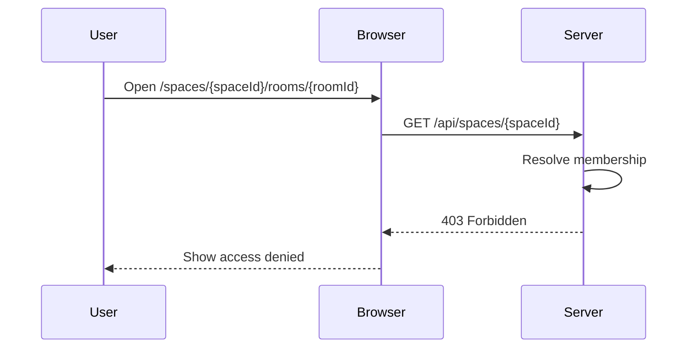
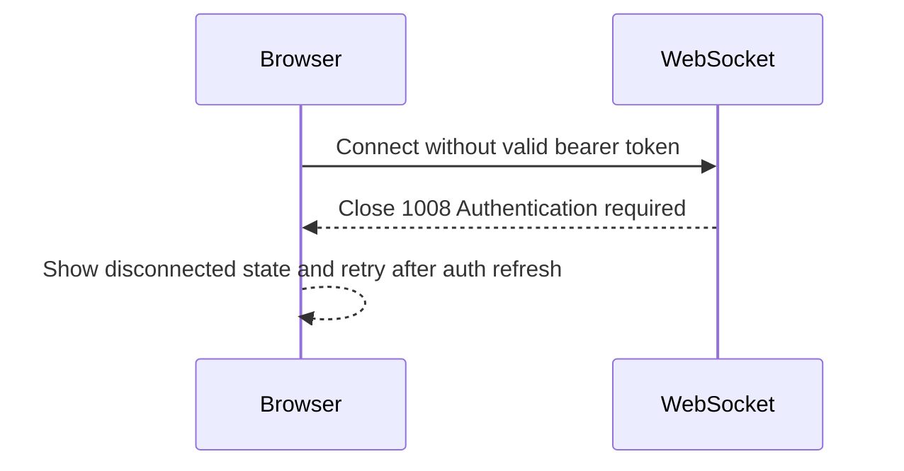

# Flow: Registered Collaborator Access

**Actors:** Collaborator
**Trigger:** Collaborator receives an invite URL and opens it

The invite token is not an access credential. It is redeemed by a logged-in user and converted into space membership. After redemption, all access uses the user's normal authenticated session.

---

## Happy Path

---

## Login-Required Path

---

## Error Paths

### E1: Invalid, Expired, or Consumed Invite

### E2: User Is Not a Member

### E3: WebSocket Authentication Fails

---

## Acceptance Tests

### Test 1: Invite Redemption Creates Membership

**Given** a valid invite and an authenticated collaborator
**When** the collaborator redeems the invite
**Then** the server creates a membership row
**And** the collaborator lands on `/spaces?space={spaceId}`
**And** the collaborator can load promoted Rooms for that space

### Test 2: Space List Is Member-Scoped

**Given** two registered users with different memberships
**When** each calls `GET /api/spaces`
**Then** each sees only spaces where they have membership

### Test 3: WebSocket Requires Authenticated Membership

**Given** a registered user without membership
**When** they connect to `/ws/spaces/{spaceId}`
**Then** the server rejects the connection

---

## Post-Conditions

- Invite token removed from URL
- Invite marked consumed
- Collaborator has durable space membership
- Collaborator starts from Rooms home
- File and chat access use normal authenticated authorization
