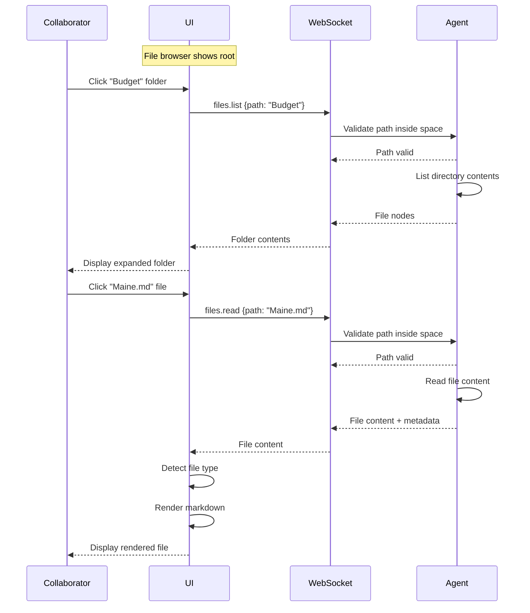
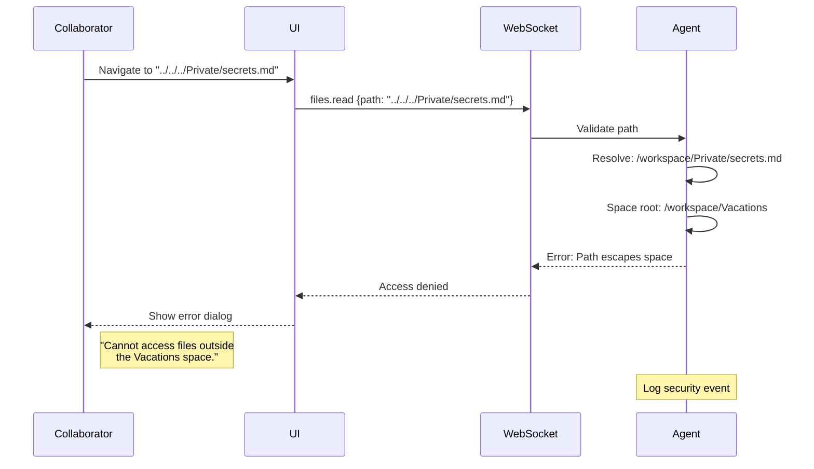
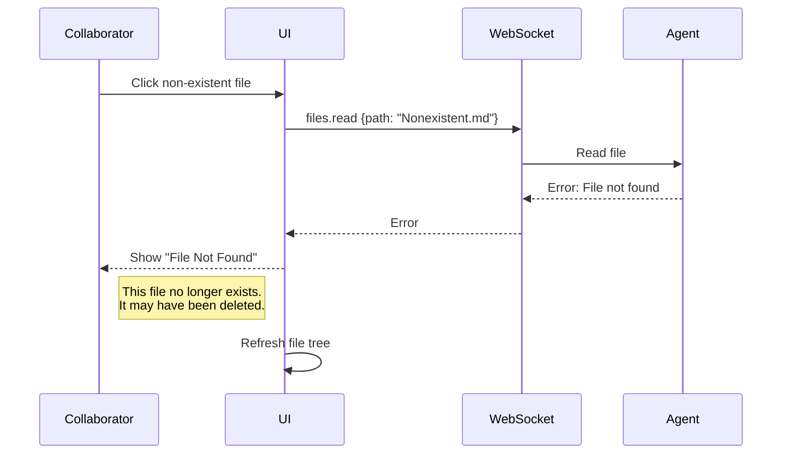
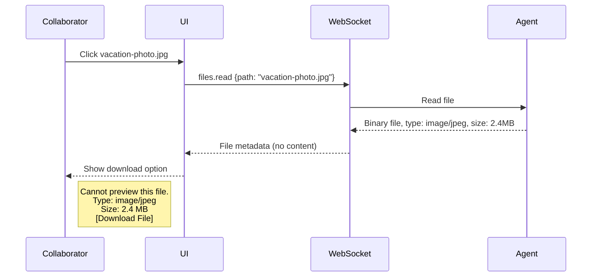
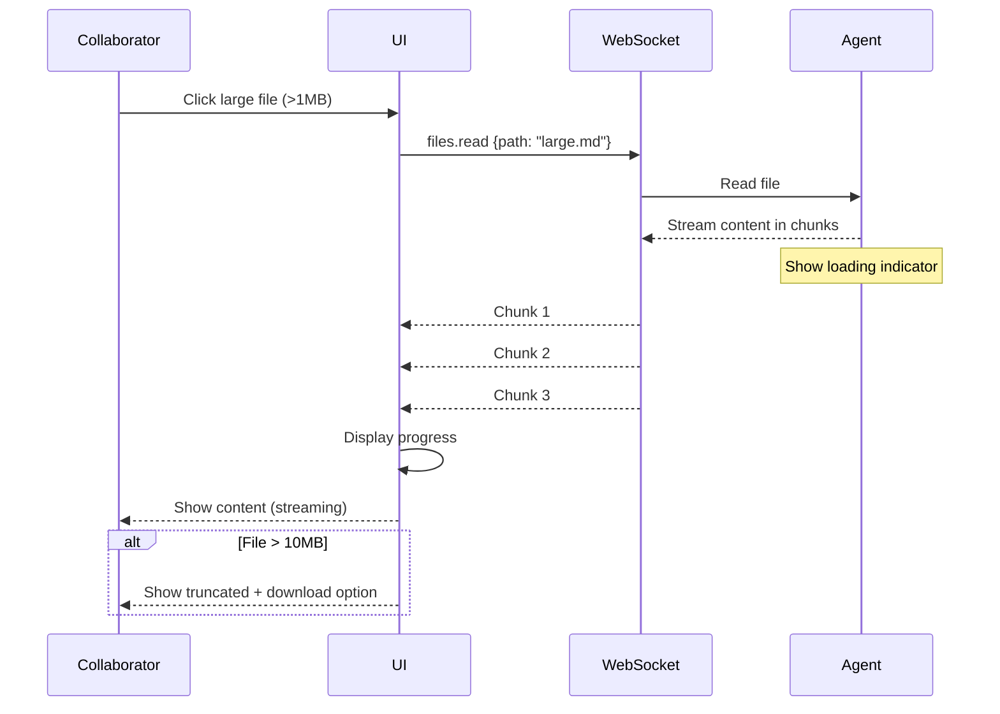
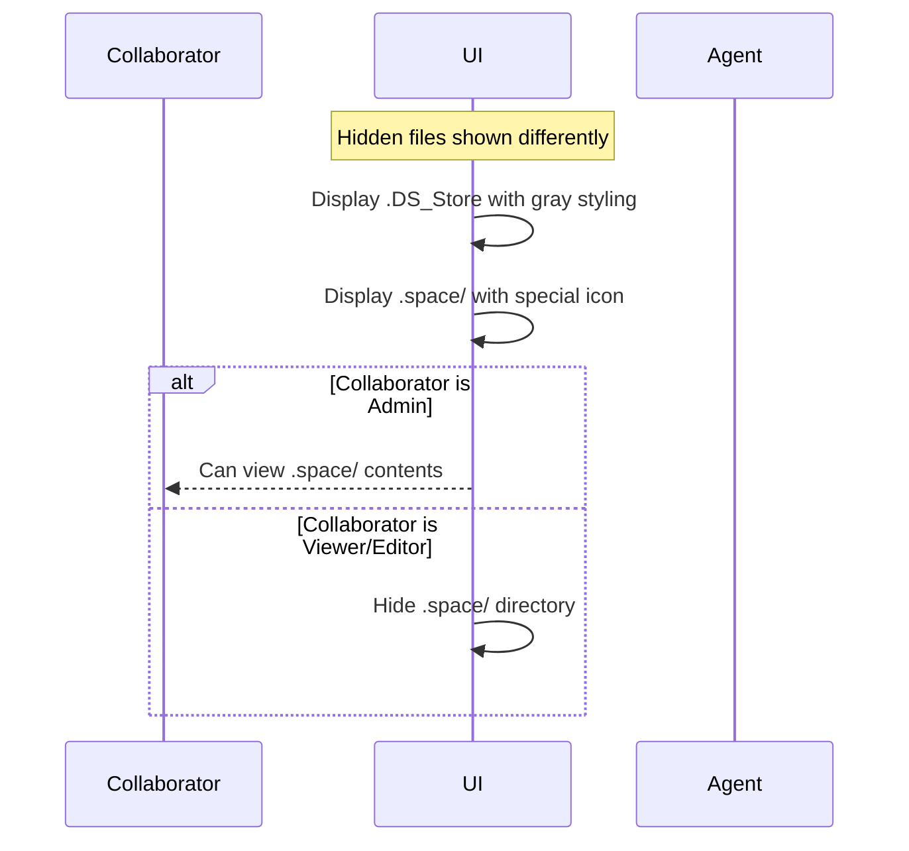

# Flow: Browse Files

**Actors:** Collaborator  
**Trigger:** Collaborator clicks files/folders in file browser

---

## Happy Path



---

## Error Paths

### E1: Path Escape Attempt



### E2: File Not Found



### E3: Binary File



---

## Edge Cases

### EC1: Large File



### EC2: Nested Folders

```mermaid
flowchart TD
    A[Root] --> B[Vacations/]
    B --> C[Budget/]
    C --> D[2026/]
    D --> E[April/]
    E --> F[expenses.csv]
    
    Note right of A: Breadcrumb: Vacations / Budget / 2026 / April
    Note right of F: Deep navigation supported
```

### EC3: Hidden Files



---

## Acceptance Tests

### Test 1: Basic Navigation

**Given** space with nested folders  
**When** collaborator clicks folders  
**Then** folder expands  
**And** contents display  
**When** collaborator clicks file  
**Then** content loads in main panel

### Test 2: Path Escape Prevention

**Given** editor role  
**When** collaborator attempts to read `../../Private/secrets.md`  
**Then** request is blocked  
**And** error shows "Cannot access files outside space"  
**And** attempt logged for security audit

### Test 3: Binary File

**Given** binary file in space  
**When** collaborator clicks file  
**Then** download option shown  
**And** file metadata displayed (size, type)

---

## Timing

| Action | Duration |
|--------|----------|
| Expand folder | < 500ms (lazy load) |
| Load file <1MB | < 1s |
| Load file >1MB | <5s (streamed) |
| Path validation | < 10ms |

---

## Post-Conditions

- File content displayed
- Path shown in breadcrumb
- File visible in tree
- Content cached in memory